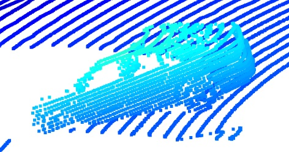
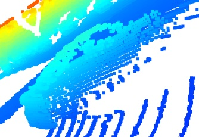
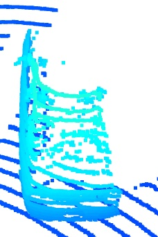
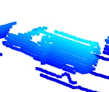
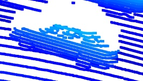
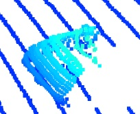
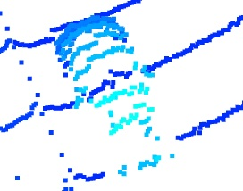
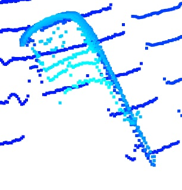
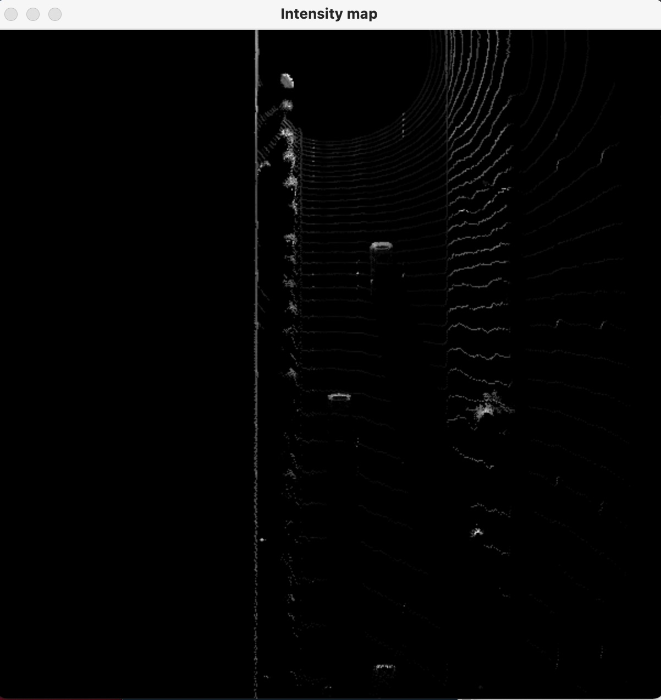
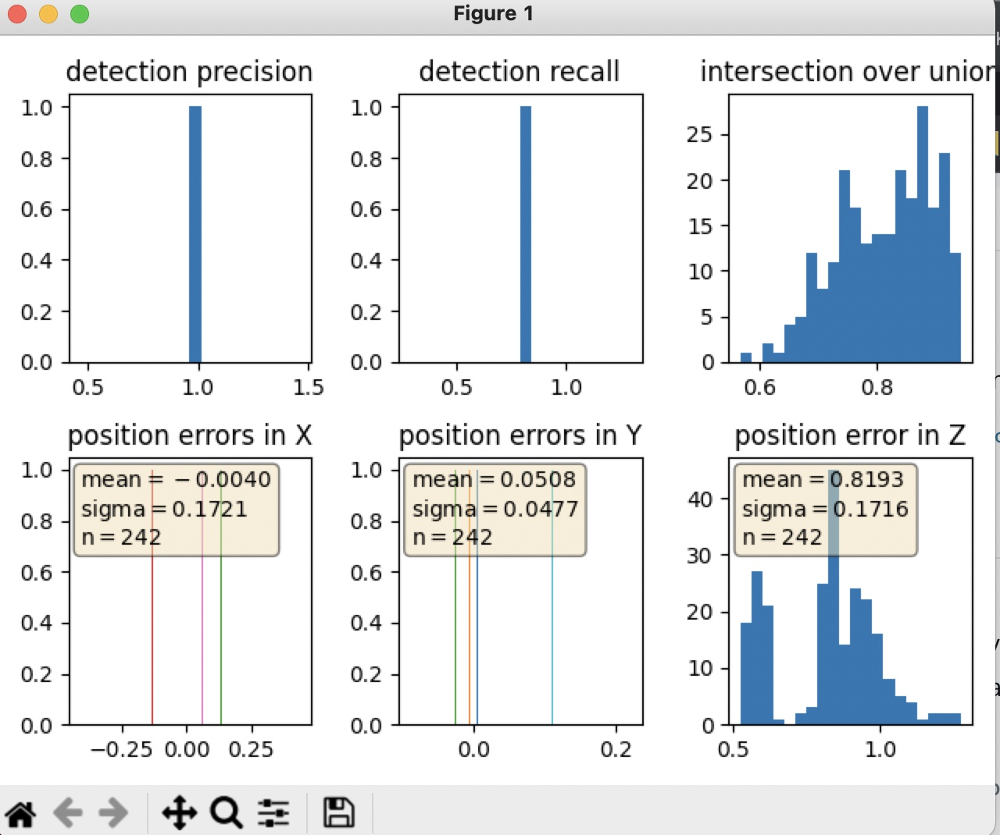

# Midterm Writeup

## Pictures of various car point clouds

- The vehicle features that appear stable are the sides/corners of the car that are facing the LiDAR sensor. They mostly include tail-lights and side/rear bumpers. Windows are often not included in the point clouds, because of low reflectivity, while the metallic body of the car is almost always included.

Here is the normalized intensity map for one of the photos. It demonstrates that the car bumpers are the part of the car that the LiDAR captures very well.

Here are the data plots for the detection of vehicles using the LiDAR sensor data:
Precision = 96.41%
Recall = 79.08%

 